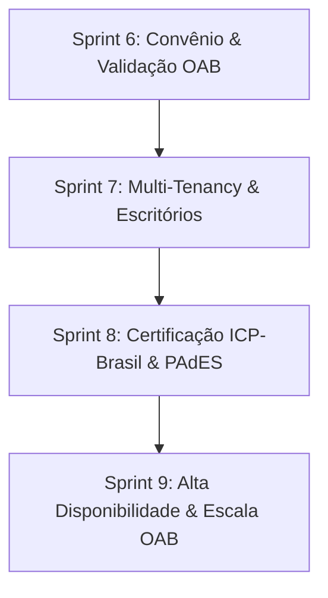

# 🏛️ LEGISVOX v2.3 — PLANO ESTRATÉGICO MASTER (CONVÊNIO OAB & ROADMAP)
**Documento de Alinhamento Multi-Agente e Engenharia**  
**Data:** 24 de Agosto de 2026  
**Status do Projeto:** Produção Ativa (`https://legisvox.com`)  
**Contexto:** Convênio Institucional com a Ordem dos Advogados do Brasil (OAB)

---

## 📌 1. Visão Geral do Projeto

O **LEGISVOX** é uma plataforma SaaS jurídica (*LegalTech*) desenvolvida especificamente para advogados, que transforma exportações de conversas do WhatsApp (textos, áudios, imagens e documentos) em **Relatórios Preparatórios e Atas Estruturadas** formatadas para instrução processual com rigor probatório, carimbo de integridade SHA-256 e conformidade com a LGPD e o Provimento OAB.

---

## 🏆 2. Histórico Consolidado: Sprints 1 a 5 (100% Concluídas)

Todas as 33 vulnerabilidades e otimizações identificadas na auditoria de código foram resolvidas e validadas em produção:

### 🔴 Sprint 1 — Kill Switch (Bloqueadores Críticos de Produção)
* **Backdoor Eliminada:** Remoção definitiva de `bypass_admin` e `ALLOW_TEST_BYPASS` em 7 arquivos (`auth.py`, `atas.py`, `pipeline_orchestrator.py`, etc.).
* **Vazamentos de Tokens:** Limpeza do `console.log` de PIN em `ResetSignaturePinModal.jsx`.
* **Rede Interna Gotenberg:** Comunicação isolada na rede Docker interna (`http://gotenberg:3000`).
* **Healthcheck & Docker Hardening:** Endpoint `/health` monitorado e flag `no-new-privileges: true`.
* **CORS Restrito:** Bloqueio de origens `localhost` em ambiente de produção.

### 🟠 Sprint 2 — Fortress (Blindagem da Camada de Dados no Supabase)
* **RLS em 6 Tabelas:** Ativado Row Level Security em `credit_balances`, `credit_transactions`, `payments`, `credit_packages`, `audit_logs` e `asaas_customers`.
* **Guards de Identidade em RPCs:** Funções `debit_credits`, `refund_credits`, `grant_welcome_credits` e `add_credits` com verificação obrigatória de `auth.uid()`.
* **Hashes Criptográficos:** CPF/CNPJ com HMAC-SHA256 (chave secreta) e PINs de assinatura com auto-upgrade transparente para **bcrypt com salt**.
* **Índices de Performance:** `idx_credit_transactions_advogado` e `idx_audit_logs_created_at`.

### 🟠 Sprint 3 — Shield (Proteção DoS, Recursos & Conexões)
* **Rate Limiting:** Aplicado `@limiter.limit` em `/upload` (5/min), `/estimate` (10/min), `/confirm` (5/min) e `/generate-pdf` (10/min).
* **Proteção contra Zip Bomb & OOM:** Teto de 50 MB por mídia e 250 MB em RAM durante extração em `whatsapp_parser.py`.
* **Pool LRU de Clientes Supabase:** Cache thread-safe de instâncias em `database.py` (TTL 10 min), evitando vazamentos de conexões HTTPX.
* **Semáforo de Concorrência:** `asyncio.Semaphore(5)` em `pipeline_orchestrator.py` para enfileiramento seguro de tarefas pesadas de IA.
* **Sanitização SSRF:** Bloqueio de requisições a redes privadas RFC1918 e metadados de nuvem (`169.254.169.254`).

### 🟡 Sprint 4 — Turbo (Alta Performance)
* **PDF Encryption Não-Bloqueante:** Offload das operações do `pypdf` para thread pool (`run_in_executor`).
* **Parser Otimizado:** Busca de participantes indexada em $O(1)$ por sufixo de 8 dígitos.
* **Eliminação de Queries N+1:** Unificação de chamadas de atualização e busca de perfil em `routers/auth.py`.
* **Cache Imutável de Assets:** Cabeçalhos `Cache-Control: public, max-age=31536000, immutable` configurados no Caddy.

### 🟢 Sprint 5 — Armor (Hardening Final & UI)
* **Headers de Segurança Bancária:** CSP estrito, HSTS de 1 ano com preload, `Permissions-Policy`, `nosniff` e `DENY` de iframes.
* **Container Não-Root:** API executando como `USER appuser` (UID 1000).
* **SSL Enforce:** Ativado no `supabase/config.toml`.
* **Observabilidade & Error Boundary:** Captura de exceções via `Sentry.captureException` no frontend React.
* **Pooler Supavisor:** Documentação da porta 6543 para conexões de alta escala.

---

## 🚀 3. Novo Roadmap: Sprints Estratégicas para o Convênio OAB

Com o anúncio do convênio com a OAB, o sistema deve evoluir para atender à demanda em escala e aos requisitos institucionais:



### 🏛️ Sprint 6 — Convênio OAB, Cupons & Validação CNA (Próxima)
* **Validação OAB / CNA:** Validação do número de inscrição da OAB e Seccional (ex: OAB/SP 123456) no cadastro.
* **Sistema de Cupons & Descontos Institucionais:** Mecanismo para cupons de parceria (ex: `OABSP-20`, `CONVENIO-OAB`) concedendo bônus de créditos ou desconto na compra de pacotes via Asaas.
* **Landing Page Co-Branded:** Página de boas-vindas dedicada para advogados conveniados (`/oab` ou `/convenio`).

### 🏢 Sprint 7 — Multi-Tenancy, Subcontas & Escritórios (Faturamento Unificado)
* **Gestão de Escritórios (B2B):** Conta master do escritório com compra centralizada de pacotes de créditos.
* **Subcontas de Advogados Associados:** Convite de advogados da banca para consumir do saldo coletivo com controle de permissões (Admin vs Advogado Associado).
* **Compartilhamento Seguro de Atas:** Permissão de acesso a processos e atas dentro do mesmo escritório jurídico.

### 🔏 Sprint 8 — Certificação Digital ICP-Brasil (PAdES / A1 & A3)
* **Assinatura Digital Avançada ICP-Brasil:** Suporte opcional à assinatura com certificado digital (Token A3 ou Arquivo A1) no padrão PAdES (PDF Advanced Electronic Signatures), em complemento à assinatura eletrônica atual por PIN/Hash.
* **Carimbo do Tempo (Timestamping Autorizado):** Integração com autoridade de carimbo do tempo (ACT) para comprovação incontestável de tempestividade.

### ⚡ Sprint 9 — Infraestrutura de Escala Massiva & Filas
* **Fila Assíncrona com Redis / Celery / BullMQ:** Migração do semáforo em memória para workers dedicados distribuídos quando o volume de uploads simultâneos crescer com a base da OAB.
* **Armazenamento de Longo Prazo em S3/R2:** Bucket com criptografia em repouso e retenção configurável para grandes volumes de áudios/ZIPs.

---

## 📋 4. Guia de Deploy e Atualização na VPS

```bash
# Conectar na VPS
ssh root@103.199.185.100

# Atualizar repositório e reconstruir containers
cd /opt/notorialAI
git pull origin main
docker compose down
docker compose up -d --build
docker compose ps
```

---

## 🎯 5. Instruções de Continuidade para Qualquer Agente

1. **Leitura Obrigatória:** Antes de propor alterações na arquitetura, consulte este arquivo (`docs/PLANO_ESTRATEGICO_OAB_SPRINTS.md`).
2. **Preservação de Segurança:** Nunca reintroduza bypasses de autenticação, acessos sem RLS no Supabase ou métodos síncronos no event loop.
3. **Foco Atual:** O objetivo imediato da equipe é estruturar a **Sprint 6 (Convênio OAB & Cupons)** mantendo a estabilidade de produção.
