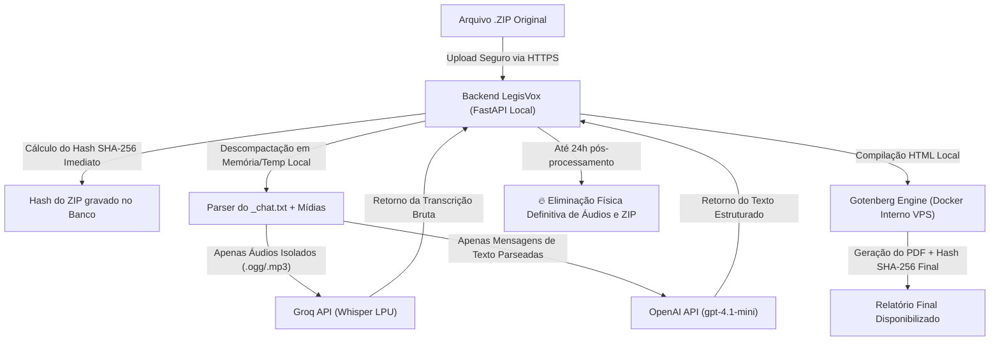

# 🔒 Relatório de Conformidade: Política de Retenção Zero (Zero Data Retention - ZDR) e IA

**Documento Técnico-Jurídico — LegisVox v2.3**  
**Data de Emissão:** 24 de Agosto de 2026  
**Finalidade:** Comprovação técnica e contratual de que os dados submetidos à plataforma LegisVox não são utilizados para treinamento de modelos de Inteligência Artificial nem retidos pelos provedores de tecnologia.

---

## 1. Arquitetura de Processamento e Segregação de Dados

O LegisVox opera sob o princípio de **Minimização de Dados (LGPD, Art. 6º, III)**. O processamento das conversas de WhatsApp segue uma esteira rigorosamente compartimentada:

---

## 2. Provedor de Linguagem: OpenAI LLC (API Comercial)

### 2.1. Termos de Serviço da API Comercial (Business / Platform Terms)
Ao contrário das versões gratuitas/consumer (ChatGPT Web), a utilização da **OpenAI API comercial** por meio de chaves de API empresariais é regida pelos seguintes termos estritos:

1. **Vedação Absoluta de Treinamento:**
   * *Cláusula Contratual:* Conforme os [Termos de Uso da API Comercial da OpenAI](https://openai.com/policies/business-terms), a OpenAI expressamente se compromete a **não utilizar nenhum dado, prompt, mensagem ou arquivo trafegado via API comercial para treinar, retreinar ou aprimorar seus modelos** (GPT-4, etc.).
2. **Política de Retenção Zero (Zero Data Retention - ZDR):**
   * As requisições enviadas pelo backend do LegisVox utilizam endpoints corporativos sem armazenamento persistente em disco pela OpenAI além da janela técnica de trânsito.
3. **Criptografia em Trânsito e Repouso:**
   * Todo o tráfego com a OpenAI é protegido por **TLS 1.3** e gerenciado por chamadas autenticadas via Bearer Token armazenado em variáveis de ambiente seguras.

---

## 3. Provedor de Transcrição: Groq Inc. (Whisper LPU)

### 3.1. Arquitetura de Transcrição Efêmera
Para transcrição dos arquivos de áudio de conversas (.ogg, .mp3, .wav), o LegisVox utiliza a API corporativa da **Groq Inc.**, executando instâncias dedicadas do modelo **Whisper**:

1. **Processamento em Memória (LPUs):**
   * O processamento dos áudios ocorre em chips de aceleração LPU (Language Processing Units) de altíssima velocidade, sem escrita em bancos de dados relacionais por parte da Groq.
2. **Retenção Efêmera:**
   * Os dados de áudio são eliminados imediatamente após a geração do texto da transcrição.
3. **Não Utilização para Treinamento:**
   * Os termos de serviço de API para desenvolvedores da Groq garantem a confidencialidade dos dados de áudio trafegados.

---

## 4. Geração de PDF: Gotenberg (100% On-Premises / Docker)

Um diferencial crítico de segurança e conformidade do LegisVox:

* **Isolamento Total:** A conversão do documento revisado em PDF não utiliza nenhuma API externa nem serviços em nuvem pública de conversão de documentos.
* **Motor Interno:** O LegisVox roda um contêiner **Gotenberg** dedicado diretamente no servidor VPS da própria plataforma.
* **Zero Risco de Vazamento:** O HTML e as transcrições nunca saem da rede interna da VPS durante a montagem do PDF final.

---

## 5. Garantias Formais para os Termos de Uso e DPAs

Com base nas evidências técnicas acima, o setor jurídico (Dr. Carlos) dispõe de respaldo probatório pleno para incluir as seguintes declarações nos **Termos de Uso** e na **Política de Privacidade**:

> **"Os dados e mensagens submetidos pelo Usuário são processados exclusivamente por meio de APIs corporativas que operam sob rigorosa política de Retenção Zero (Zero Data Retention - ZDR). É terminantemente vedado aos provedores de inteligência artificial a utilização dos conteúdos, áudios ou transcrições para treinamento ou aprimoramento de modelos públicos ou privados."**
