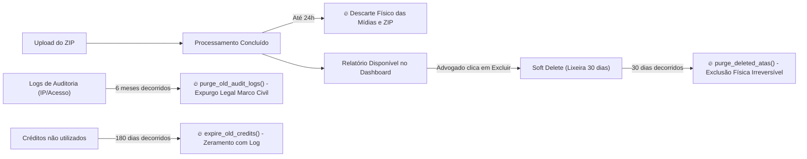

# 📋 Relatório Técnico-Jurídico: Comparativo Antes x Depois (LegisVox v2.3)

**Para:** Carlos (Jurídico LegisVox)  
**De:** Equipe de Engenharia e Arquitetura de Software  
**Data:** 19 de Agosto de 2026  
**Status do Sistema:** Sprints 1, 2 e 3 implementadas, testadas e ativas em produção.

---

## Sumário Executivo

Este documento apresenta o mapeamento fático e técnico das adequações realizadas no LegisVox em resposta aos 15 itens da análise jurídica elaborada pelo Dr. Carlos. 

As providências executadas estruturam o sistema sob o paradigma de **Privacy by Design**, eliminam passivos de terminologia/publicidade, estabelecem trilha auditável de consentimento, definem a política de retenção automatizada e fundamentam a redação dos novos **Termos de Uso**, **Política de Privacidade**, **Termo de Responsabilidade** e acordos de processamento de dados (**DPAs**) com fornecedores.

---

## 1. Terminologia e Publicidade (Item 1 da Análise)

Todas as páginas públicas, landing page, dashboards, tutoriais, modais, rodapés de PDF e prompts de IA passaram por varredura textual para eliminação de expressões com risco de responsabilização ou usurpação de funções notariais.

| Expressão Proibida | Como estava ANTES | Como está DEPOIS | Onde foi corrigido |
| :--- | :--- | :--- | :--- |
| **"Criptografia Base64"** | O perfil alegava: *"criptografia Base64 em trânsito e at-rest"*. | *"Os dados são protegidos por medidas técnicas e administrativas de segurança, compatíveis com a natureza das informações tratadas."* | `Profile.jsx` |
| **"Autenticidade garantida" / "Protocolo de autenticidade"** | Constava na Landing Page e nos Termos como garantia jurídica de autenticidade. | Substituído por *"Integridade documental verificável por hash SHA-256"*. | `FeaturesSection.jsx`, `TermsOfUse.jsx` |
| **"Cadeia de custódia"** | Afirmava que a plataforma garantia "cadeia de custódia legal". | Substituído por *"Mecanismo técnico de verificação de integridade por resumo criptográfico"*, sem prometer cadeia pericial oficial. | `TermsOfUse.jsx`, `PrivacyPolicy.jsx`, `politicas legisvox.md` |
| **"Fé pública do advogado"** | Modal do PIN afirmava: *"Fé Pública & Emissão sob responsabilidade do advogado"*. | *"Confirmação e Emissão — Representa sua conferência eletrônica sobre o relatório gerado."* | `SignaturePinPromptModal.jsx` |
| **"Segurança notarial" / "Folhas notariais"** | Mencionava atributos exclusivos de cartório em tutoriais e e-mails de recuperação. | Substituído por *"PIN de confirmação e assinatura eletrônica interna"* e *"páginas de relatório"*. | `TutorialModal.jsx`, `auth.py` |
| **"Assinatura digital SHA-256"** | Confundia hash matemático com assinatura digital qualificada ICP-Brasil. | Substituído por *"Resumo criptográfico SHA-256"*. | `PrivacyPolicy.jsx`, `PinVerificationModal.jsx` |
| **"97%+ de precisão" / "Menos de 5 min"** | Promessas comerciais sem laudo pericial anexado. | *"Alta precisão na transcrição (resultados podem variar conforme qualidade do áudio, idioma e formato)"*. | `FeaturesSection.jsx`, `StatsBar.jsx`, `HowItWorks.jsx`, `README.md` |
| **"Pronto para protocolo"** | Promessa de admissibilidade judicial automática. | *"Pronto para revisão e eventual utilização profissional"*. | `FeaturesSection.jsx` |
| **"Assistente Notarial"** | Prompt da IA se autoidentificava como assistente notarial. | Alterado no backend para *"Assistente jurídico de organização documental"*. | `ai_organizer.py` |
| **Aviso de ausência de fé pública** | Ausente em algumas telas e relatórios. | Disclaimer explícito no rodapé do PDF e nas interfaces: *"Sem fé pública. A conferência com o arquivo original (Hash SHA-256 do ZIP: {hash}) é obrigatória."* | `pdf_generator.py`, `TermsAcceptanceModal.jsx` |

---

## 2. Preços, Créditos e Regras Comerciais (Item 2 da Análise)

O backend e o frontend foram sincronizados para operar sob regras comerciais consistentes e transparentes:

| Item da Análise | Regra Real Implementada no Backend | Como o Usuário Visualiza |
| :--- | :--- | :--- |
| **Quantidade Mínima / Máxima** | **Mínimo:** 50 créditos (páginas) / **Máximo:** 2.000 créditos por compra avulsa no pacote Sob Medida. | Slider interativo em `Credits.jsx` com faixas de 5 em 5 créditos. |
| **Pacotes Fixos x Sob Medida** | 5 pacotes fixos reativados no banco (50, 100, 300, 500 e 1.000) + 1 pacote Sob Medida (50 a 2.000). | Preço por página varia de **R$ 0,55** (Sob Medida/Starter) até faixas com desconto em pacotes maiores. |
| **Validade dos Créditos** | **180 dias corridos** (6 meses) a contar da confirmação do pagamento via webhook Asaas. | Gravado na coluna `expires_at` da tabela `credit_balances` e informado no modal pré-compra e no Perfil. |
| **Créditos Gratuitos (Trial)** | **50 créditos gratuitos** concedidos automaticamente no primeiro cadastro (tipo `trial`). | Criados pelo trigger `handle_new_user` no Supabase sem necessidade de cartão de crédito. |
| **Créditos Expirados** | Rotina automática diária (`expire_old_credits`) zera saldos onde `expires_at < now()`, gerando log em `audit_logs`. | Formalizado na cláusula 3.6 dos Termos de Uso. |
| **Devolução em Falha de Processamento** | Se o pipeline falhar após debitar a estimativa, a função `refund_credits` no backend devolve 100% dos créditos automaticamente. | Implementado no `except` de `atas.py` e formalizado na cláusula 8.5 dos Termos. |
| **Ajuste de Estimativa x Páginas Reais** | O sistema faz pré-reserva pela estimativa do ZIP; ao compilar o PDF final com o Gotenberg, estorna a diferença se o relatório final tiver menos páginas que o estimado. | Transação do tipo `refund` gravada em `credit_transactions`. |

---

## 3. Aceite dos Termos e Registro Contratual (Item 3 da Análise)

A arquitetura de consentimento foi totalmente reformulada para garantir valor probatório em caso de litígio com usuários:

| Requisito do Jurídico | Como estava ANTES | Como está DEPOIS |
| :--- | :--- | :--- |
| **Checkbox no Cadastro** | Usuário criava conta sem clicar em checkbox de aceite. | Checkbox **obrigatório e desmarcado** no cadastro (`Login.jsx`). Não permite criar conta sem marcar. |
| **Consentimento de Marketing** | Inexistente ou embutido no aceite geral. | Checkbox **separado, 100% facultativo e desmarcado**. Não impede a criação da conta se não for marcado. |
| **Rastreabilidade e Prova de Aceite** | Campo de data genérico no banco. | Nova tabela `consent_records` registrando: `advogado_id`, `consent_type` (terms/privacy/marketing), `ip_address`, `user_agent`, `device_fingerprint` e carimbo `accepted_at` (UTC). |
| **Versionamento Contratual** | Sem versionamento no banco. | Tabela `terms_versions` com histórico de versões (seed: `2.3`). Se o jurídico lançar a v2.4, o sistema detecta automaticamente a defasagem. |
| **Gate Global de Re-aceite** | Usuários antigos continuavam usando sem re-aceitar termos novos. | Componente `TermsReacceptanceGate` no `App.jsx`: exibe modal bloqueante exigindo novo aceite caso a versão do usuário seja inferior à versão vigente (sem bloquear a leitura prévia de `/terms` e `/privacy`). |
| **Resumo Pré-Compra Obrigatório** | Ao clicar em comprar, gerava o PIX direto. | Modal **"Resumo da Compra"** antes de gerar cobrança: detalha quantidade de páginas, preço unitário, total, validade de 180 dias e aviso de não-reembolso de créditos consumidos. |
| **Consulta no Perfil** | Não havia histórico para o usuário. | Seção **"Termos e Consentimento"** no `Profile.jsx` exibindo: *"✅ Termos aceitos em: DD/MM/AAAA — Versão: 2.3"*. |

---

## 4. Termo de Responsabilidade Documental (Item 4 da Análise)

* **Desacoplamento de Endpoints:** O aceite geral da plataforma (`/api/consent/accept`) foi **totalmente separado** do aceite de responsabilidade antes de gerar cada documento específico (`TermsAcceptanceModal.jsx` e `PinVerificationModal.jsx`).
* **Vínculo Documental:** Antes de compilar o PDF com o Gotenberg, o sistema exige que o advogado digite seu **PIN de 4 dígitos**. A ação grava no log de auditoria:
  * `ata_id` (identificador único do documento)
  * `zip_hash` (SHA-256 do arquivo bruto submetido)
  * `advogado_id` + `ip_address` + `user_agent` + `device_fingerprint`
  * Declaração expressa do advogado como **Controlador dos Dados** inseridos na plataforma.

---

## 5. Cookies e Tecnologias de Rastreamento (Item 5 da Análise)

### Resultado da Auditoria Técnica no Código-Fonte:
* **Google Analytics, PostHog, Facebook Pixel:** **Zero ocorrências no código.** Nenhum script de terceiros para publicidade ou analytics comportamental está ativo.
* **Cookies (`document.cookie`):** **Zero cookies** gravados ou lidos via JavaScript.
* **Armazenamentos Técnicos Locais Encontrados:**
  1. `localStorage.getItem('sb-<ref>-auth-token')`: Token JWT de autenticação do Supabase (estritamente necessário para manter a sessão).
  2. `localStorage.getItem('theme')`: Preferência de tema visual (escuro/claro).
  3. `localStorage.getItem('legisvox_tutorial_seen')`: Flag booleana para não reabrir o tutorial da interface.
  4. `sessionStorage.getItem('user_cpf_raw')`: CPF em cache temporário apenas durante a aba aberta para preenchimento de nota fiscal no Asaas.

> **Decisão Jurídica/Técnica Adotada:** Como todos os armazenamentos são **estritamente funcionais e técnicos**, a plataforma está dispensada de banner de cookies obstrutivo (opt-in/opt-out), sendo incluída a **nova Seção 5 na Política de Privacidade** com total transparência sobre cada item armazenado.

---

## 6. Inventário de Tratamento de Dados (ROPA Técnico) (Item 6 da Análise)

| Dado Tratado | Categoria | Finalidade | Onde Fica Armazenado | Prazo de Retenção |
| :--- | :--- | :--- | :--- | :--- |
| **Nome, E-mail, OAB, UF** | Cadastral | Identificação do profissional e autenticação | Supabase (`auth.users` e `public.advogados`) | Enquanto a conta estiver ativa ou até exclusão |
| **CPF/CNPJ** | Fiscal / Identificação | Emissão de Nota Fiscal no Asaas e prevenção a fraudes | `public.advogados` (hash SHA-256 para indexação) | Retenção fiscal legal (5 anos) vinculada ao Asaas |
| **PIN de Confirmação** | Segurança | Assinatura eletrônica interna do relatório | `public.advogados.senha_assinatura_hash` | Hash irreversível via **bcrypt** (com salt) |
| **IP, User-Agent, Fingerprint** | Conexão / Auditoria | Marco Civil da Internet (Art. 15) e prova de consentimento | `public.audit_logs` e `public.consent_records` | **6 meses** (expurgo automático via RPC) |
| **Arquivo .ZIP e Mídias (Áudios/Imagens)** | Conteúdo Bruto | Processamento e extração probatória | Armazenamento temporário em disco no servidor | **Eliminação em até 24 horas** após conclusão |
| **Transcrição e Chat Processado** | Conteúdo Estruturado | Disponibilização para revisão do advogado | `public.atas_conteudo` (PostgreSQL) | Até exclusão pelo usuário ou **30 dias após soft-delete** |
| **Hashes SHA-256 (ZIP e PDF)** | Prova Técnica | Verificação de integridade documental | `public.atas.zip_hash` e `pdf_hash` | Mantidos enquanto o registro do relatório existir |

---

## 7. Fornecedores e Suboperadores (Item 7 da Análise)

| Fornecedor / Produto | Finalidade | Dados Recebidos | País de Processamento | Política de Treinamento / Retenção |
| :--- | :--- | :--- | :--- | :--- |
| **Supabase Inc.** | Banco de Dados PostgreSQL, Autenticação e RLS | Dados cadastrais, logs, metadados de relatórios | EUA (AWS us-east-1) | Criptografia at-rest AES-256. DPA padrão enterprise. |
| **Asaas IP S.A.** | Gateway de Pagamento PIX e Notas Fiscais | Nome, CPF/CNPJ, E-mail, valor da compra | Brasil | Instituição financeira regulada pelo Banco Central. |
| **OpenAI LLC** | Organização lógica, cronológica e formatação textual | Trechos de mensagens de texto anônimas nos prompts | EUA | API comercial sob política **Zero Data Retention (ZDR)**; não treina modelos com dados da API. |
| **Groq Inc. / Whisper** | Transcrição de áudios em alta velocidade | Arquivos de áudio (.ogg, .mp3, .wav) extraídos do ZIP | EUA | Processamento em chips LPU sob API corporativa efêmera. |
| **Gotenberg** | Motor de compilação HTML → PDF | HTML final estruturado do relatório | **Hospedado localmente (Docker na VPS)** | 100% interno e isolado; nenhum dado trafega para terceiros. |
| **Cloudflare Inc.** | Túnel de segurança, proteção DDoS e TLS | Tráfego web criptografado (HTTPS) | Global / Edge | Não armazena dados em repouso. |
| **Sentry (Functional Software Inc.)** | Monitoramento e diagnóstico de erros do sistema | Stack traces de erros técnicos (sem dados do chat) | EUA | Retenção máxima de 30 dias para telemetria de erro. |

---

## 8. Processamento por Inteligência Artificial (Item 8 da Análise)

* **O arquivo ZIP é enviado inteiro para a IA?** **NÃO.** O arquivo ZIP é descompactado localmente no backend em Python (`notorial-api`). Apenas os textos parseados de mensagens e os arquivos de áudio isolados são enviados via chamadas de API pontuais.
* **Modelo utilizado para texto:** `gpt-4.1-mini` via API corporativa da OpenAI (configurado com parâmetros determinísticos `temperature=0.1` para fidelidade total ao texto original).
* **Transcrição de áudio:** Engine Whisper via endpoint corporativo da Groq.
* **Treinamento de Modelos:** Ambas as integrações utilizam **APIs pagas comerciais**, cujos termos de serviço garantem que os dados trafegados **NÃO são utilizados para treinar ou aprimorar modelos públicos de IA**.

---

## 9. Política Real de Retenção e Expurgo Automatizado (Item 9 da Análise)

### Funções Programadas no Banco de Dados (RPCs PostgreSQL):
1. **`purge_deleted_atas()` (Diário às 03:00):** Exclui permanentemente do banco todas as atas, transcrições e chats onde `deleted_at < now() - interval '30 days'`. Registra no log de auditoria a quantidade de registros destruídos.
2. **`purge_old_audit_logs()` (Mensal):** Exclui registros de auditoria com mais de 6 meses (Marco Civil, Art. 15), preservando apenas incidentes de segurança.
3. **`expire_old_credits()` (Diário às 02:00):** Zera saldos de créditos que ultrapassaram o prazo de 180 dias (`expires_at < now()`).

---

## 10. Segurança da Informação e Criptografia (Item 10 da Análise)

* **Em trânsito:** Todo o tráfego é forçado em **TLS 1.3 / HTTPS** através de túnel Cloudflare e Caddy Reverse Proxy com certificados SSL renovados automaticamente.
* **Em repouso (At-Rest):** Banco de dados PostgreSQL criptografado em repouso por padrão (padrão de infraestrutura do Supabase / AWS EBS AES-256).
* **Proteção do PIN do Advogado:** O PIN de 4 dígitos é criptografado com **bcrypt** (algoritmo com custo computacional e salt único por usuário). O sistema bloqueia a conta após **5 tentativas incorretas consecutivas**, exigindo reset via link por e-mail com token temporário de 15 minutos.
* **Segregação de Dados:** Implementação rigorosa de **Row Level Security (RLS)** em todas as tabelas do Supabase. Mesmo com requisição direta ao banco, um usuário só consegue consultar e manipular os seus próprios registros (`auth.uid() = advogado_id`).

---

## 11. Acesso Administrativo e Privacidade (Item 11 da Análise)

* **Segregação do Suporte:** O painel administrativo (`AdminDashboard.jsx`) é restrito a contas com flag `is_admin = true`.
* **Proteção de Conteúdo:** O painel administrativo exibe apenas **metadados operacionais** (nome do advogado, e-mail, OAB, quantidade de créditos e status do processamento). O conteúdo de mensagens íntimas de WhatsApp e áudios **não fica exposto** na listagem administrativa geral.

---

## 12. Exclusão de Conta e Direitos do Titular (LGPD Art. 18) (Item 13 da Análise)

* **Exclusão Self-Service no Perfil:** Implementada a "Zona de Perigo" no `Profile.jsx`.
* **Fluxo de Confirmação:** O advogado abre o modal, visualiza o aviso de irreversibilidade (perda definitiva de relatórios, dados e créditos remanescentes sem reembolso) e digita seu **PIN de segurança**.
* **Execução via Backend (`delete_user_account`):**
  * Remove todas as atas e transcrições do usuário;
  * Remove histórico de consentimentos e transações de créditos;
  * Remove o perfil da tabela `advogados` e a conta em `auth.users`;
  * Grava um registro final em `audit_logs` comprovando a solicitação de exclusão por autoatendimento.
* **Revogação de Marketing:** Botão direto no Perfil que chama o endpoint `POST /api/consent/revoke-marketing`, atualizando o registro com `revoked_at = now()`.

---

## 13. Hashes e Verificação de Integridade (Item 14 da Análise)

1. **Momento da geração do Hash do ZIP:**
   * Gerado no backend Python (`services/whatsapp_parser.py`) no momento exato em que o upload é concluído, **antes de qualquer descompactação ou tratamento**.
   * Algoritmo: `hashlib.sha256(arquivo_bruto).hexdigest()`.
2. **Momento da geração do Hash do PDF:**
   * Gerado logo após o Gotenberg compilar o arquivo HTML em PDF binário, antes de disponibilizar para download.
3. **Exibição e Rastreabilidade:**
   * Ambos os hashes são gravados nas colunas `zip_hash` e `pdf_hash` da tabela `atas` e são impressos no relatório final para permitir a conferência pericial a qualquer tempo pelo advogado ou perito.

---

## 📌 Guia de Aplicação para o Carlos na Redação Final

Com todas as bases técnicas acima consolidadas e ativas, o Carlos pode redigir os documentos com as seguintes certezas contratuais:

1. **Nos Termos de Uso:**
   * Declarar expressamente que o serviço é de **organização e processamento técnico documental**, sem fé pública (CPC, Art. 411, III e 422).
   * Citar o prazo de **180 dias de validade dos créditos** (Cláusula 3.6).
   * Citar o descarte de arquivos brutos em **24 horas** e expurgo definitivo de lixeira em **30 dias** (Cláusula 8).
   * Citar a perda de saldo de créditos em caso de exclusão voluntária de conta (Cláusula 9.3).
2. **Na Política de Privacidade:**
   * Listar a tabela de suboperadores (Supabase, Asaas, OpenAI ZDR, Groq, Cloudflare, Sentry).
   * Manter a seção de cookies afirmando a **utilização exclusiva de armazenamentos técnicos necessários**.
   * Documentar o prazo de retenção de logs de conexão em **6 meses** (Marco Civil da Internet, Art. 15).
3. **No Termo de Responsabilidade:**
   * Manter a qualificação do advogado como **Controlador dos Dados Pessoais** e o LegisVox como **Operador da Tecnologia**.
